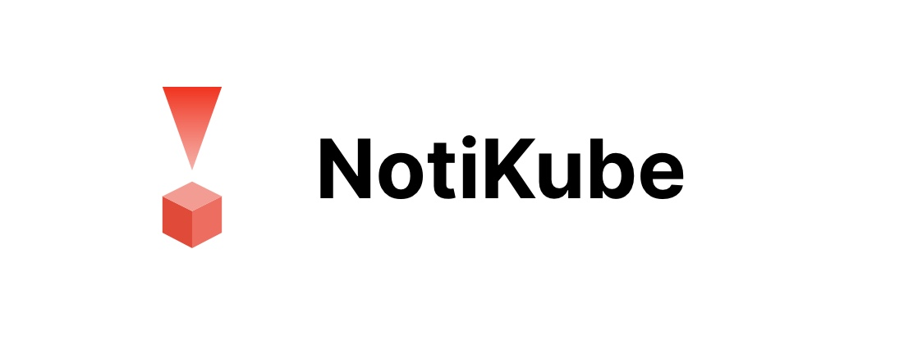
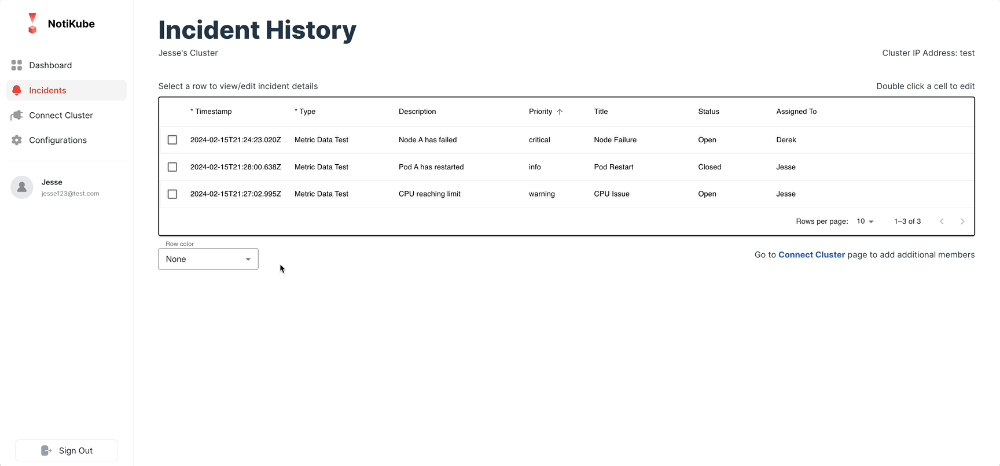
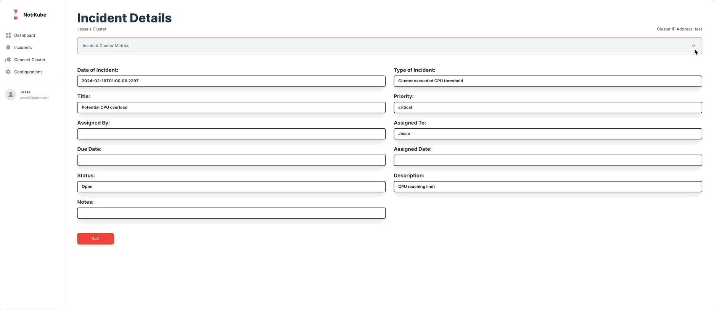

<div align="center">
	
</div>

# Introduction
Welcome to NotiKube! A platform that gives you the power to manage the lifecycle of your Kubernetes cluster's Prometheus alerts while having access to the most important health metrics, all in one view. 

Getting set up is easy, see instructions below on how to get started. Once the webhook is set up, the alerts of your choosing can be sent directly to NotiKube where they become "incidents". All of your incidents can be edited directly in the table or for a more granular view, select one and check out the incident's details. 

NotiKube gives you the power to manage your team's most important alerts so you can get your cluster back to full health in no time. 

Check out our [website](https://notikube.com) and medium article 

<div align="center">
	<code></code>
	<code></code>
	<code></code>
	<code></code>
	<code></code>
	<code></code>
	<code></code>
</div>

## Table of contents
- [Features](#features)
- [Getting started](#getting-started)
- [Meet the team](#meet-the-team)
- [Contribution guidelines](#contribution-guidelines)

## Features

- Dashboard
  - Get a snapshot of your cluster's 'incidents' plus critical metrics
<p></p>

- Incidents History
  - View, sort, and filter all incidents while directly editting cells within the table
<p></p>

- Incident Details
  - View cluster metrics at the time of the incident and update any field to track progress
<p></p>

## Getting started
- NotiKube requires a working Kubernetes cluster with Prometheus installed, if you need help setting that up we have provided instructions below to get started. Otherwise, please 
  skip ahead to **Expose prometheus-server** and **Notikube webhook** as those are necessary steps in order to use NotiKube successfully.

### 1. Create an account
- Head to [notikube.com](notikube.com) and sign-up for a new account then come back to this document
  
### 2. Set up a cluster
- See the guides below to help you set it up.
  - [Amazon Web Services](https://docs.aws.amazon.com/eks/latest/userguide/sample-deployment.html) deployment guide
  - [Azure](https://learn.microsoft.com/en-us/azure/aks/learn/quick-kubernetes-deploy-cli) deployment guide
  - [Google Cloud Platform](https://cloud.google.com/kubernetes-engine/docs/quickstarts/deploy-app-container-image) deployment guide
  - [Minikube](https://kubernetes.io/docs/tutorials/hello-minikube/) 

### 3. Install Prometheus
- To pull metrics from your Kubernetes cluster and set up alerts, we will use Prometheus.
- Helm is a package manager for Kubernetes and simplifies the process of installing Prometheus into your cluster.
  
  - Mac:
  ```
  brew install helm
  ```
  - Windows
  ```
  choco install Kubernetes-helm
  ```
  - Linux
  ```
  curl -fsSL -o get_helm.sh https://raw.githubusercontent.com/helm/helm/main/scripts/get-helm-3
  chmod 700 get_helm.sh
  ./get_helm.sh
  
- Get the official prometheus community helm chart and make sure it's up to date
```
helm repo add prometheus-community https://prometheus-community.github.io/helm-charts \ helm repo update 
```
- Install the helm chart into your cluster
```
helm install prometheus prometheus-community/prometheus
```
- Promtheus is now installed!

### 4. Expose prometheus-server
- In order for NotiKube to properly pull your cluster's metrics you'll need to expose your prometheus server's exernal IP address.
- You may need change the service type for your prometheus-server from clusterIP to LoadBalancer.
```
kubectl patch svc prometheus-server -p '{"spec": {"type":"LoadBalancer"}}' 
```
  - If you don't have kubectl, the kubernetes command-line tool, insalled check out this [guide](https://kubernetes.io/docs/tasks/tools/)
- Grab your prometheus-server's external IP address for your Notikube account
```
kubectl get services  
```

### 5. Notikube webhook
- Once you have your prometheus-server exposed, you can connect your prometheus alert manager to Notikube
- Make sure you create an account with Notikube before you continue with this step
- On your terminal, enter the following
```
kubectl edit configmaps prometheus-alertmanager
```
- Click 'i' to insert
- In the alertmanager.yml file, insert the following
```
route:
  group_wait: 10s
  group_interval: 30s
  repeat_interval: 30m
  routes:
    - receiver: "notikube"
      group_wait: 10s
      continue: true
receivers:
  - name: "notikube"
    webhook_configs:
    - url: 'https://notikube.com/api/alertmanager?email=<INSERT EMAIL HERE>'
      send_resolved: true
```
- IMPORTANT: Make sure that you follow the URL guidelines carefully
- Enter Esc and ":x" to save and exit

- To access the alerting rules, enter the following in your terminal
```
kubectl edit configmaps prometheus-server
```
- Click 'i' to insert
- In the alerting_rules.yml file, you can add your specific alerts based on the template provided here
```
groups:
- name: example
  rules:
  - alert: <INSERT ALERT NAME>
    expr: <INSERT TRIGGERING EVENT>
    labels:
      severity: <critical/warning/error/info>
    annotations:
      summary: <SUMMARY>
      description: <DESCRIPTION>
```
- Enter Esc and ":x" to save and exit

Head back to [notikube](notikube.com), sign-in, add your prometheus-server external IP address in the 'connect cluster' page, and then you are all set!

## Meet the team
- Jesse Chou - [GitHub](https://github.com/jesse-chou/) | [LinkedIn](https://www.linkedin.com/in/jesse-chou/)
- Dane Smith  - [GitHub](https://github.com/danealexandersmith) | [LinkedIn](https://www.linkedin.com/in/danealexandersmith/)
- Derek Coughlan  - [GitHub](https://github.com/derekcoughlan) | [LinkedIn](https://www.linkedin.com/in/derekcoughlan/)
- Emmanuel Ikhalea  - [GitHub](https://github.com/DeveloperIkhalea) | [LinkedIn](https://www.linkedin.com/in/emmanuel-ikhalea-222781178/)
- Apiraam Selvaskbaran  - [GitHub](https://github.com/apiraam96) | [LinkedIn](https://www.linkedin.com/in/apiraam-selvabaskaran/)

## Contribution guidelines
- Contributions play a vital role in the open-source community. If you'd like to make a contribution to NotiKube please follow the steps below.
   - Fork the project.
   - Create and work off of your own feature branch.
   - Create a pull request with a detailed description of your changes using our template to merge your feature branch into dev.
   - We will review and get back to you!
